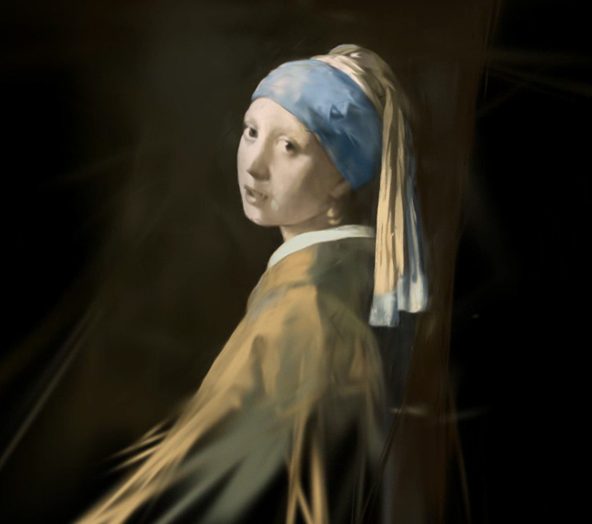
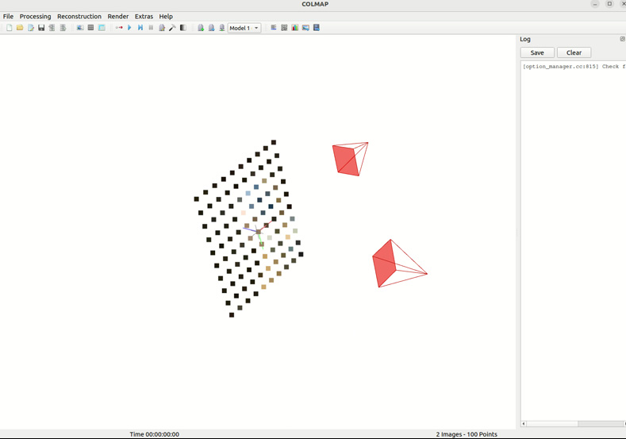

# Gaussian Painters

<blockquote>This is a fork of <a href="https://github.com/graphdeco-inria/gaussian-splatting">3D Gaussian Splatting</a>. Refer to the original repo for instructions on how to run the code.</blockquote>



## How to create a Gaussian Painter dataset

After having installed the 3D Gaussian Splatting code, run the following command:

```bash
python create_dataset.py --img_path /path/to/image --output_dir /path/to/output_dir
```

You can disable the `opacity_reset_interval` argument by setting it to 30_000.

You can also set `sh_degree` to 0 to disable viewdependent effects.

This will create a dataset ready to be trained with the Gaussian Splatting code.


## Visualize the "painting" process

Using the SIBR visualizer, you can visualize the "painting" process during the Gaussian Splatting optimization.


https://github.com/ReshotAI/gaussian-painters/assets/16474636/b29731b6-5fcc-43f5-a169-bfed2b109ce0


## How it works?

The `create_dataset` script simply creates a COLMAP output directory with a single camera pointing at a plane. 100 points are sampled from the image and used as initial point cloud for the Gaussian Splatting optimization. A second perpendicular image is also created with a black image as target.


